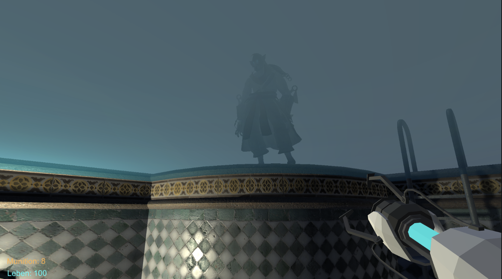
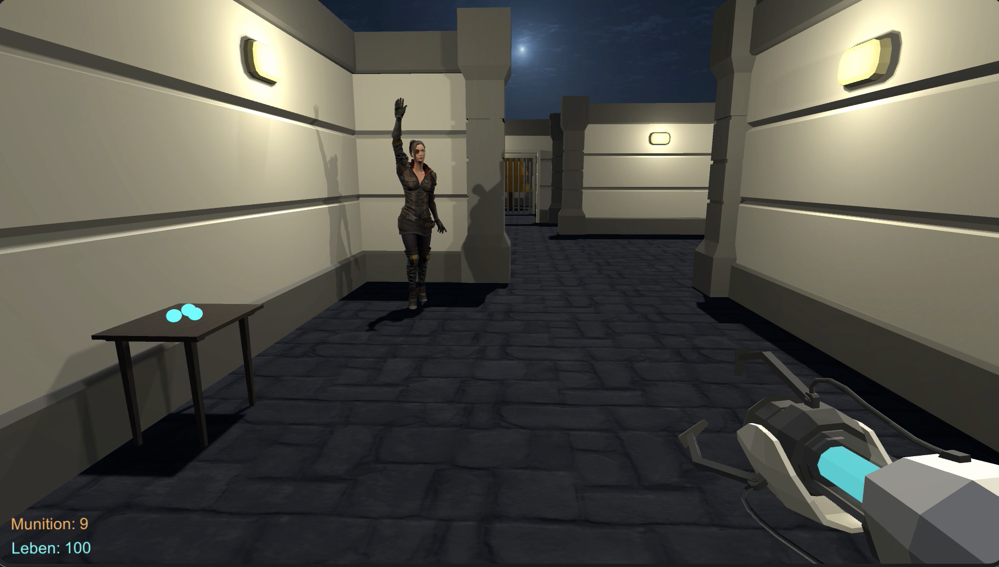
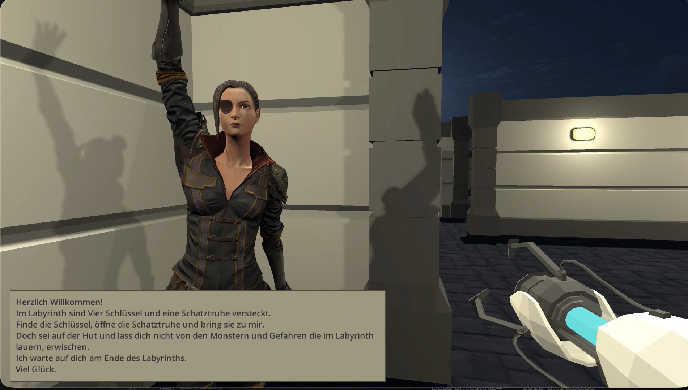
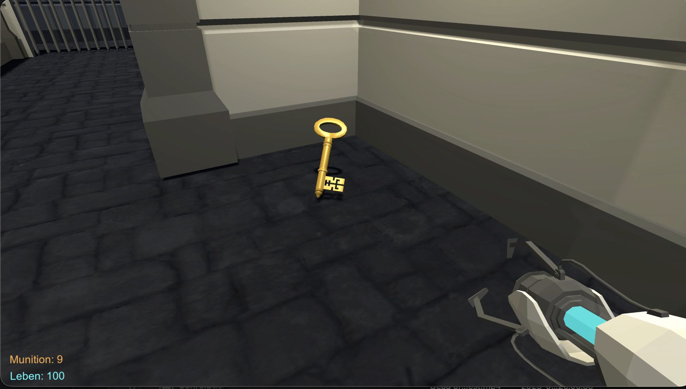

Game Projekt
---------------------------

Ein eigenes Game-Development-Projekt wird derzeit mit der
Programmiersprache C# und der Game Engine Unity umgesetzt.
Dabei liegt der Fokus auf einem kreativen Grafikstil und einem
ansprechenden User Interface Design. Ein interaktiver Prototyp
des UI wurde mit Figma erstellt. Das Projekt befindet sich aktuell in
der Entwicklungsphase.

Game Idee
---------------------------

Ziel: Alle Artefakte finden und sammeln und das Ziel erreichen ohne zu sterben 

- [ ] Spielfeld Labyrinth 
    - [ ] Wände, Türen, Belichtung, Dekorationen, etc. 
    - [x] Nächtliche Atmosphäre

- [x] FirstPersonPersektive i
    - [x] Über das Spielfeld bewegen/springen
    - [x] Schießen/Elemente zerstören

- [x] Waffenwechsel mit Rechtsklick
    - [x] Gun 
    - [x] Schwert
    - [x] Taschenlampe

- [x] Artefakte finden: 
Das Ziel öffnet sich erst, wenn du mehrere versteckte Items (Schlüssel, Artefakte, Schalter) aktiviert hast.
Artefakte: Schlüssel, Schatzkiste

- [x] Gegner:  
    - [x] Im Spielfeld verteilt
    - [x] greifen Player an
    - [x] Player kann dadurch sterben
    - [x] Lebenspunkte Anzeige
    - [ ] Respawn Gegner (nach einer bestimmten Zeit tauchen sie nach dem Tod wieder auf)

- [ ] Explosive Munition:
Schüsse können 
    - [x] Wände oder 
    - [ ] Fallen zerstören.

- [x] Begrenzte Munition: 
    - [x] Munition begrenzen, 
    - [x] Munition kann während des Spiels gesammelt werden.  

- [ ] Mehrere Varianten:
Scene Duplikationen, Elemente anders verteilt 
Beim Sterben des Players wird neue Szene geladen, beginn von vorne, Elemente anders platziert im Spiel 

- [ ] Effekte:
    - [ ] Feuer (Player kann Schaden durch z.b. Feuer erleiden) 
    - [ ] Wasser
    - [ ] Nebel 
    - [ ] Dunkelheit (eingeschränkte Sicht) 
    - [ ] Veränderbare Wände (Bewegbar)

- [ ] Soundeffekte: 
    - [ ] Gegnersound 
    - [ ] Sound beim Aufsammeln der Artefakte 
    - [ ] Hintergrundsound
    - [ ] Sound, wenn gewonnen 

- [x] Informationsfenster: 
    - [x] Anzahl Artefakte 
    - [x] Anzahl gefundene Artefakte (als Abbildung Schlüssel / Schatztruhen) 
    - [x] Anzahl vorhandene Munition
    - [x] Informationstexte 

- [ ] Spielanleitung
    - [ ] 1. Am Eingang ein Objekt mit Informationstext, was der Player zu tun hat zb. Finde alle Artefakte und schalte das Ziel frei ohne Schaden zu nehmen. 
    - [ ] 2. Informationstext auf dem Startbildschirm 
    - [x] 3. NPC mit Informationstext Story Modus mäßig (z.B. Finde meine Schlüssel und bring sie mir) —> NPC = Goal

—————
Erweiterung: 
- [ ] Schwierigkeitsgrad Zeitlimit
Ziel: Alle Artefakte finden und sammeln und das Ziel ohne zu sterben innerhalb einer gewissen Zeit erreichen.

Screenshots: 
---------------------------

+ auch im Ordner "game-screenshots"