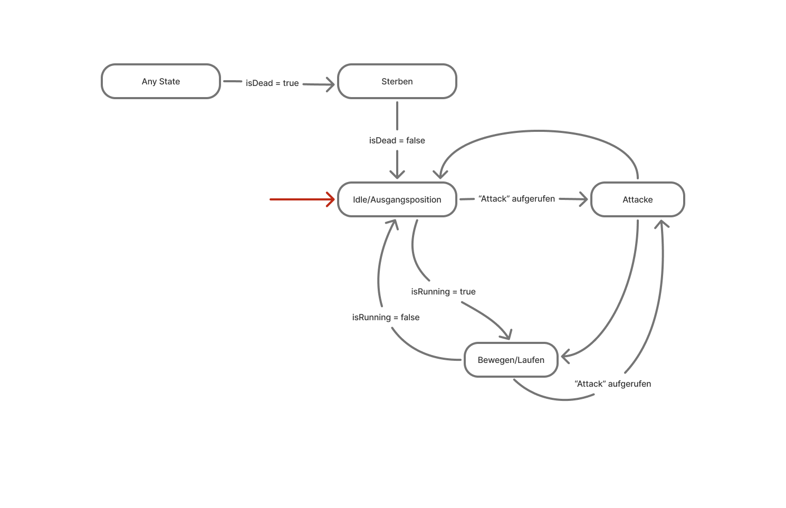
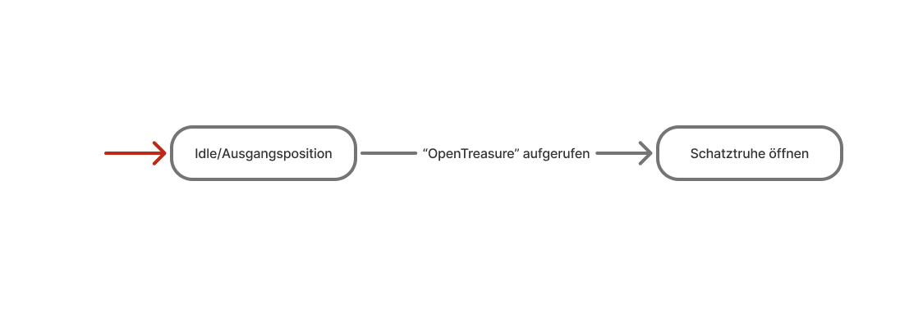
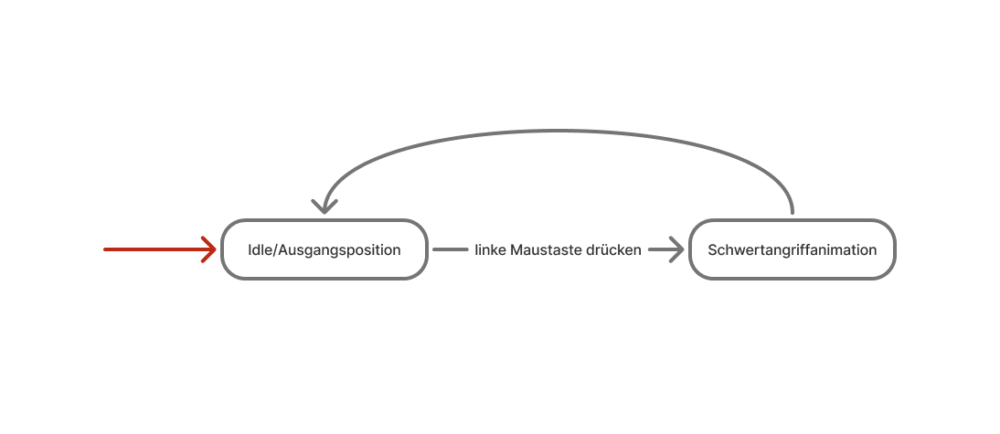
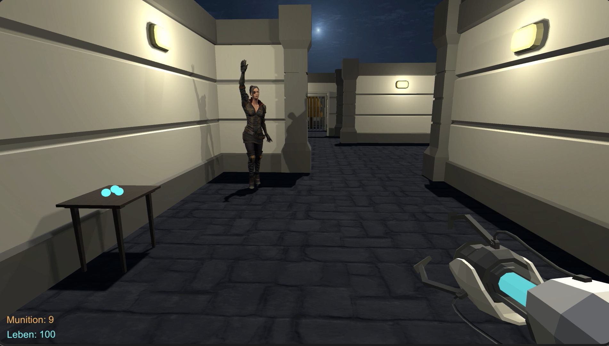
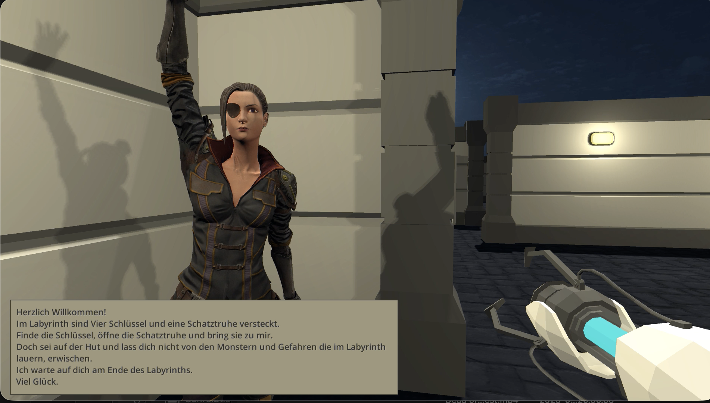
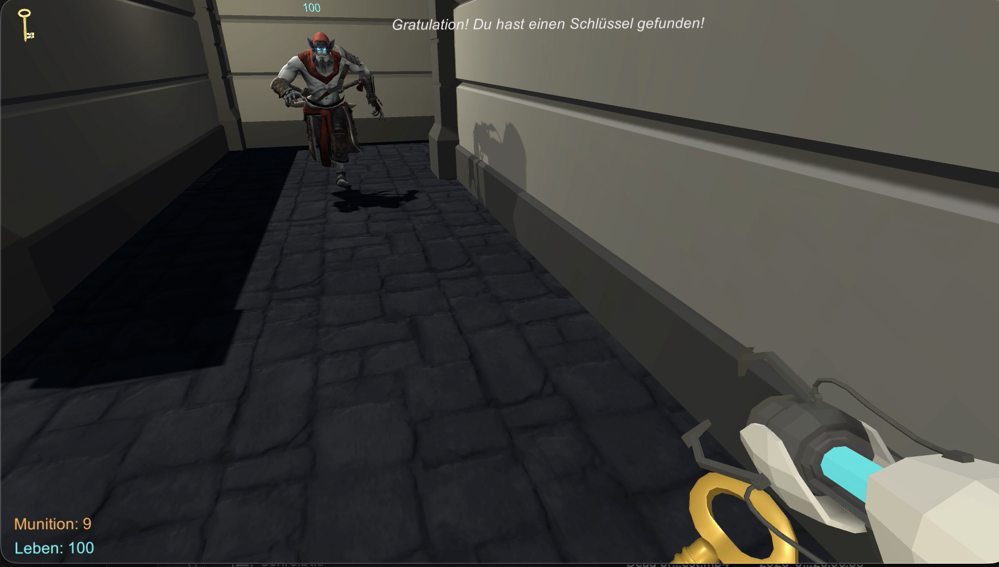
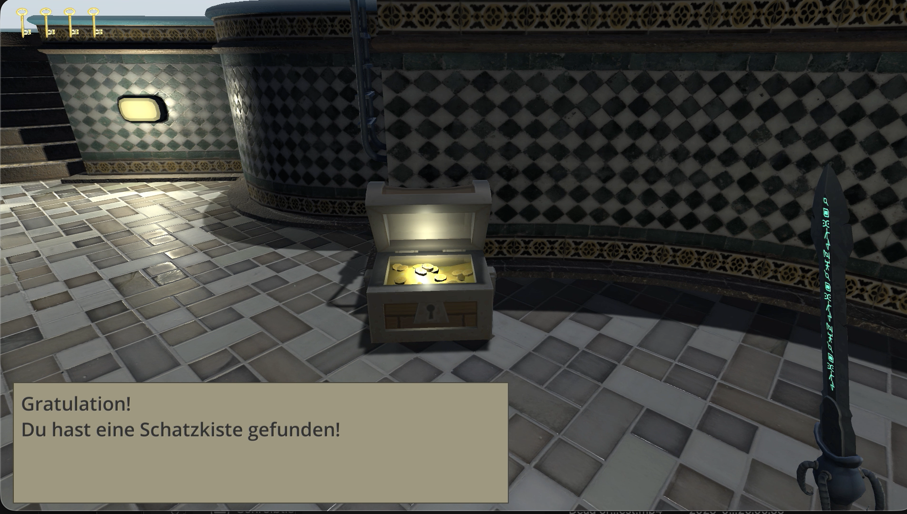
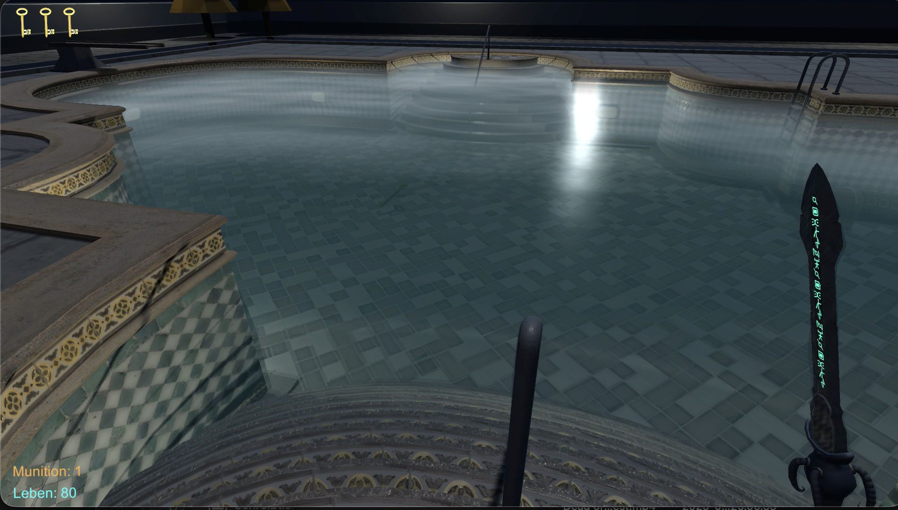
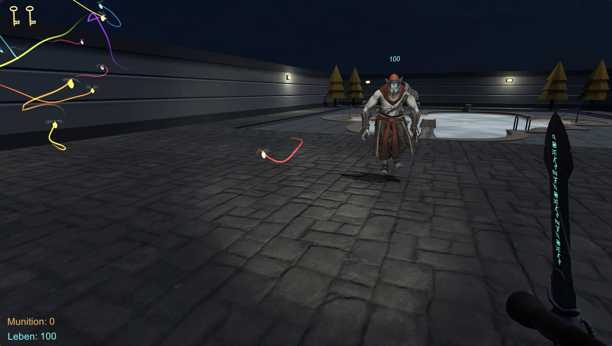
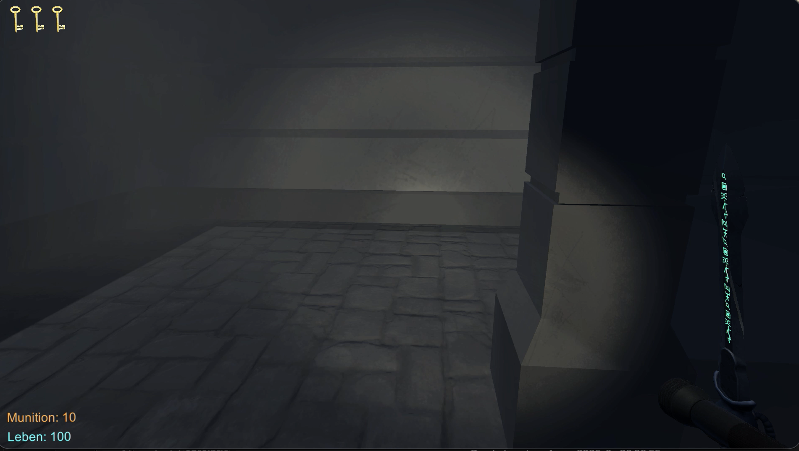

# Game Development Projekt – Unity & C#

Derzeit wird ein eigenes Game-Development-Projekt mit der Programmiersprache C# und der Unity Game Engine entwickelt.
Der Schwerpunkt des Projekts liegt auf einem kreativen Grafikstil, einer intuitiven Benutzerführung sowie einem modernen UI/UX-Design.

Im Rahmen der Konzept- und Designphase wurden bereits:

- UI/UX-Wireframes erstellt
- Userflows konzipiert
- erste Gameplay-Mechaniken in Unity umgesetzt

## Ziel des Projekts

Das Ziel des Spiels besteht darin, alle versteckten Artefakte innerhalb verschiedener Spielbereiche zu finden und einzusammeln, ohne dabei zu sterben.
Spieler müssen Hindernisse überwinden, Gefahren vermeiden und strategisch vorgehen, um das finale Ziel zu erreichen.

Zusätzlich soll das Projekt praktische Erfahrungen in folgenden Bereichen vertiefen:

- Game Development mit Unity
- Programmierung mit C#
- UI/UX Design
- Userflow-Planung
- Interaktive Prototypen
- Gameplay-Mechaniken

## Game Idee

Ziel: Alle Artefakte finden und sammeln und das Ziel erreichen ohne zu sterben 

- [ ] Spielfeld Labyrinth 
    - [ ] Wände, Türen, Belichtung, Dekorationen, etc. 
    - [x] Nächtliche Atmosphäre

- [x] FirstPersonPersektive i
    - [x] Über das Spielfeld bewegen/springen
    - [x] Schießen/Elemente zerstören

- [x] Waffenwechsel mit Rechtsklick
    - [x] Gun 
    - [x] Schwert
    - [x] Taschenlampe

- [x] Artefakte finden: 
Das Ziel öffnet sich erst, wenn du mehrere versteckte Items (Schlüssel, Artefakte, Schalter) aktiviert hast.
Artefakte: Schlüssel, Schatzkiste

- [x] Gegner:  
    - [x] Im Spielfeld verteilt
    - [x] greifen Player an
    - [x] Player kann dadurch sterben
    - [x] Lebenspunkte Anzeige
    - [ ] Respawn Gegner (nach einer bestimmten Zeit tauchen sie nach dem Tod wieder auf)

- [ ] Explosive Munition:
Schüsse können 
    - [x] Wände oder 
    - [ ] Fallen zerstören.

- [x] Begrenzte Munition: 
    - [x] Munition begrenzen, 
    - [x] Munition kann während des Spiels gesammelt werden.  

- [ ] Mehrere Varianten:
Scene Duplikationen, Elemente anders verteilt 
Beim Sterben des Players wird neue Szene geladen, beginn von vorne, Elemente anders platziert im Spiel 

- [ ] Effekte:
    - [ ] Feuer (Player kann Schaden durch z.b. Feuer erleiden) 
    - [ ] Wasser
    - [ ] Nebel 
    - [ ] Dunkelheit (eingeschränkte Sicht) 
    - [ ] Veränderbare Wände (Bewegbar)

- [ ] Soundeffekte: 
    - [ ] Gegnersound 
    - [ ] Sound beim Aufsammeln der Artefakte 
    - [ ] Hintergrundsound
    - [ ] Sound, wenn gewonnen 

- [x] Informationsfenster: 
    - [x] Anzahl Artefakte 
    - [x] Anzahl gefundene Artefakte (als Abbildung Schlüssel / Schatztruhen) 
    - [x] Anzahl vorhandene Munition
    - [x] Informationstexte 

- [ ] Spielanleitung
    - [ ] 1. Am Eingang ein Objekt mit Informationstext, was der Player zu tun hat zb. Finde alle Artefakte und schalte das Ziel frei ohne Schaden zu nehmen. 
    - [ ] 2. Informationstext auf dem Startbildschirm 
    - [x] 3. NPC mit Informationstext Story Modus mäßig (z.B. Finde meine Schlüssel und bring sie mir) —> NPC = Goal

—————
Erweiterung: 
- [ ] Schwierigkeitsgrad Zeitlimit
    - Ziel: Alle Artefakte finden und sammeln und das Ziel ohne zu sterben innerhalb einer gewissen Zeit erreichen.
     
## Aktueller Stand
Das Projekt befindet sich noch in der Entwicklungsphase.

## Besonderheiten des Projekts
- Kombination aus Game Development und UI/UX Design
- Fokus auf intuitive Benutzerführung
- Eigenständige Konzeption und Umsetzung
- Praktische Anwendung moderner Design- und Entwicklungsprozesse

# Design Screens (Figma)
## Wireframes: 
Die Wireframes visualisieren:

- Aufbau der Navigation
- Positionierung der UI-Elemente
- Benutzerfluss zwischen Menüpunkten
- Erste Designideen für Layout und Stil

### Startseite (Main Menu) 
Die Startseite dient als zentraler Einstiegspunkt des Spiels und wurde mit Fokus auf Übersichtlichkeit und einfache Navigation gestaltet.

Funktionen der Startseite
- Starten des Spiels
- Zugriff auf Spielinformationen
- Beenden des Spiels

### Modusauswahl (Game Mode Selection)
Die Modusauswahl ist eine zusätzliche Seite innerhalb des Spiels, auf der Spieler den gewünschten Spielmodus auswählen können.
Die Benutzeroberfläche wurde so gestaltet, dass die verschiedenen Modi klar dargestellt und schnell auswählbar sind.

- Im Level-Modus müssen verschiedene Spielbereiche nacheinander abgeschlossen werden.
- Das Ziel besteht darin, alle Artefakte eines Levels zu sammeln und das Ziel sicher zu erreichen, ohne zu sterben.

    - Eigenschaften
        - Fortschritt durch mehrere Level
        - Unterschiedliche Schwierigkeitsgrade
        - Erkundung und strategisches Gameplay
        - Fokus auf Präzision und Überleben

- Im Zeit-Modus müssen Artefakte innerhalb eines begrenzten Zeitlimits gesammelt werden.
- Dieser Modus legt den Fokus auf schnelles Reaktionsvermögen und effiziente Bewegungen.

    - Eigenschaften
        - Zeitlimit pro Runde
        - Schnelles Gameplay
        - Höherer Schwierigkeitsgrad durch Zeitdruck
        - Vergleich von Bestzeiten möglich

### Spielscreen (Gameplay Screen)
Der Spielscreen zeigt die eigentliche Gameplay-Ansicht und enthält alle wichtigen Informationen für die Spieler.

- Funktionen des Spielscreens
    - Anzeige des aktuellen Spielbereichs
    - Darstellung gesammelter Artefakte
    - Lebens- oder Statusanzeige
    - Spielersteuerung und Interaktionen (Waffenauswahl)
    - Feedback bei Erfolgen oder Fehlern im Informationstextfeld

+ weitere Wireframes befinden sich im Ordner `wireframes_figma` (dazu gehören zusätzliche Ansichten der Benutzeroberfläche, Gameplay-Screens)

## User Flows – Menü & Spielaktionen
Die User Flows beschreiben die typischen Abläufe und Interaktionen der Spieler innerhalb des Menüs sowie während des Gameplays. Sie helfen dabei, die Navigation logisch aufzubauen und eine intuitive Benutzerführung sicherzustellen.

- Hauptmenü Flow
     - Der Einstieg ins Spiel beginnt im Hauptmenü.

- Ablauf:
    - Startseite → Hauptmenü → Modusauswahl → Spielstart

### Animation der Gegner:

### Animation zum Öffnen der Schatztruhen:

### Animation des Schwertes:

# Umsetzung in Unity (Screenshots):
Erste Gameplay-Mechaniken in Unity umgesetzt:

## Startposition: 

## Anzeige Dialogtext, bei Annäherung eines NPCs (Non-Player-Characters):

## Gegener und Informationstextansicht: 

## Schatztruhe: 

## Waffenansicht (Schwert): 

## Waffenansicht (Schwert + Taschenlampe): 

## Nebelanimation:

+ weitere Screenshots befinden sich im Ordner `game-screenshots` (dazu gehören zusätzliche Ansichten von ersten Umsetzungen der Gameplay-Mechaniken in Unity)
